# Software Architecture Document (SAD)

**Система:** DP-Synth Platform — генерация конфиденциальных синтетических табличных данных с дифференциальной приватностью
**Версия документа:** 1.0
**Дата:** 2026-04-25
**Статус:** Принят
**Связанные документы:**
* [REQUIREMENTS.md](REQUIREMENTS.md) — продуктовые требования (PRD)
* [ADR/](docs/ADR/) — записи об архитектурных решениях (13 ADR)
* [openapi/](docs/openapi/) — спецификации API всех 5 сервисов

---

## Содержание

1. [Введение](#1-введение)
2. [Цели и ограничения архитектуры](#2-цели-и-ограничения-архитектуры)
3. [Контекст системы (C4 Level 1)](#3-контекст-системы-c4-level-1)
4. [Контейнерная архитектура (C4 Level 2)](#4-контейнерная-архитектура-c4-level-2)
5. [Компонентная архитектура (C4 Level 3)](#5-компонентная-архитектура-c4-level-3)
6. [Динамические виды (Process / Sequence)](#6-динамические-виды-process--sequence)
7. [Логическая модель данных](#7-логическая-модель-данных)
8. [Хранение и жизненный цикл артефактов](#8-хранение-и-жизненный-цикл-артефактов)
9. [Деплоймент-вид](#9-деплоймент-вид)
10. [Конфигурационная модель](#10-конфигурационная-модель)
11. [Сквозные аспекты (Cross-cutting concerns)](#11-сквозные-аспекты-cross-cutting-concerns)
12. [Качественные атрибуты](#12-качественные-атрибуты)
13. [ML-методологический срез](#13-ml-методологический-срез)
14. [Риски, ограничения, технический долг](#14-риски-ограничения-технический-долг)
15. [Глоссарий и приложения](#15-глоссарий-и-приложения)

---

## 1. Введение

### 1.1. Назначение документа

Software Architecture Document (SAD) описывает **как именно построена**
DP-Synth Platform: какие компоненты её составляют, как они взаимодействуют,
где живут данные, как обеспечиваются качественные атрибуты.

Документ дополняет, но не дублирует:

* **PRD (`REQUIREMENTS.md`)** — что и зачем;
* **ADR** (`ADR/ADR-NNN-*.md`) — почему именно так в каждой ключевой точке выбора;
* **OpenAPI** (`openapi/*.yaml`) — машиночитаемые контракты HTTP-API.

### 1.2. Целевая аудитория

* **Разработчики**, впервые подключающиеся к проекту — как «карта местности»
  при погружении в код.
* **Архитекторы и техлиды** заказчика — для оценки готовности к интеграции
  и понимания границ модификации.
* **Ревьюеры ВКР** — как обзорный документ архитектуры.
* **Compliance / DPO** — для понимания, какие именно элементы системы
  обеспечивают DP-гарантии и где они могут быть нарушены.

### 1.3. Границы документа

В скоупе:

* Архитектура текущей кодовой базы `final_system/` (не `archive/`).
* Все 8 контейнеров: 5 сервисов приложения + Redis + 2 PostgreSQL.
* Ключевые сквозные аспекты (логирование, наблюдаемость, безопасность —
  на уровне MVP).

Вне скоупа:

* Подробный roadmap до production-уровня — см. PRD раздел 12.
* Алгоритмика ML-метрик и DP-генераторов на уровне формул — см. docstrings
  в `evaluator/` и `synthesizer/`, а также соответствующие первоисточники
  (Abadi et al. 2016 для DP-SGD, SmartNoise документация для DP-CTGAN, и т.д.).
* Внутреннее устройство сторонних библиотек (smartnoise-synth, opacus, sdv).

### 1.4. Конвенции

* C4-нотация для архитектурных видов (Context → Containers → Components → Code,
  с использованием первых трёх уровней).
* Mermaid для всех диаграмм — рендерятся прямо в Markdown на GitHub/GitLab.
* Имена контейнеров — те же, что в `docker-compose.yml`.
* Имена компонентов — те же, что в файловой системе (`api/routers/runs.py`,
  `synthesizer/dp_ctgan.py` и т.д.).

---

## 2. Цели и ограничения архитектуры

### 2.1. Архитектурные цели

| ID | Цель | Поддерживается |
|---|---|---|
| AG-1 | Изоляция тяжёлых ML-зависимостей от лёгких сервисов | Микросервисы (ADR-001) + lazy imports (ADR-012) |
| AG-2 | Заменяемость отдельных стадий пайплайна корпоративными командами | Сервис-на-домен + контракты Pydantic (ADR-001, ADR-005) |
| AG-3 | Формальные DP-гарантии и эмпирическая верификация приватности | DP-фреймворки (ADR-013) + holdout-инвариант (ADR-015) |
| AG-4 | Воспроизводимость экспериментов | random_seed + config_snapshot + версионированные образы |
| AG-5 | Сквозная трассируемость запуска от запроса до отчёта | run_id + ContextVar + объединённый /logs |
| AG-6 | Единый источник правды для контрактов API | Pydantic-схемы в `shared/schemas/` (ADR-005) |
| AG-7 | Минимальный порог входа для первого запуска | Docker Compose (ADR-002), `up -d --build` |

### 2.2. Архитектурные ограничения

#### Технологические (жёсткие)

* **Язык — Python 3.10+** для всех сервисов. Обусловлено тем, что вся
  ML-инфраструктура (`torch`, `opacus`, `smartnoise-synth`, `sdv`,
  `ctgan`, `scikit-learn`, `pandas`) живёт в Python (см. ADR-004).
* **Один формат конфига — YAML** для всех пайплайнов; валидация через
  Pydantic v2.
* **Один тип хранилища артефактов на MVP — shared Docker volume** (ADR-003).

#### Технологические (мягкие)

* HTTP-сервисы на FastAPI (ADR-004), контракты на Pydantic v2 (ADR-005).
* GPU доступна только для одного контейнера (`synthesis_service`).
* Single-host деплой, single-worker per service.

#### Регуляторные

* Реализация шагов ПНСТ ГОСТ Р по синтетическим данным.
* DP-параметры конфигурируются на уровне отрасли (см. PRD раздел 9.5):
  финансы — ε ∈ [1, 2], общий enterprise — ε ∈ [2, 5], R&D — ε ∈ [5, 10].

#### Ресурсные / временные

* Магистерская ВКР: ограниченное время на разработку и тестирование.
* Доступная инфраструктура — одна машина с одной GPU.

### 2.3. Допущения

* Один датасет помещается в RAM рабочего узла (до ~10M строк × 50 колонок).
* Активных запусков пайплайна одновременно — единицы (не сотни).
* Доверенная среда исполнения для `pickle.load` моделей (`/data/models` —
  внутренний volume).
* Доступная VRAM ≥ 8 ГБ на GPU для DP-генераторов разумного размера.

### 2.4. Известные ограничения, признаваемые архитектурой

| Ограничение | Источник | План пересмотра |
|---|---|---|
| Single-host (Docker Compose) | ADR-002, ADR-003 | PRD 12.1.4 (K8s) |
| Single-worker per service | ADR-003 | PRD 12.1.2 |
| In-memory job_store в синтезе | ADR-008 | PRD 12.1.1 |
| BackgroundTasks без durability | ADR-010 | PRD 12.1.1 |
| Pickle для моделей | ADR-009 | PRD 12.4.3 |
| Single API_KEY auth | — | PRD 12.4.1 (OIDC) |

---

## 3. Контекст системы (C4 Level 1)

Контекст-диаграмма показывает Систему как «чёрный ящик», окружённый
актёрами и внешними системами.

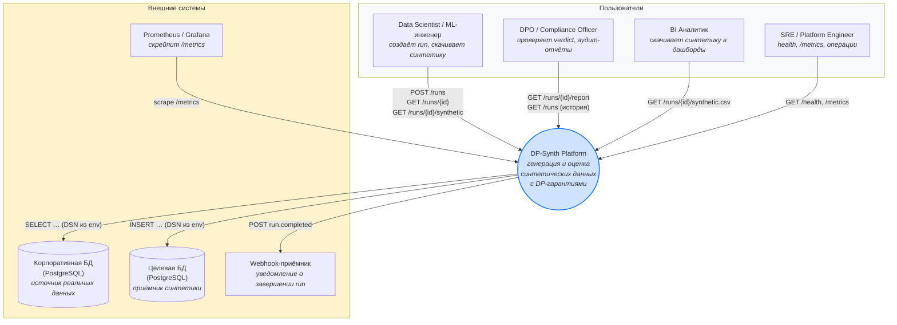

**Ключевые потоки:**

* **Inbound** — HTTP-вызовы от пользователей и систем мониторинга.
* **Outbound (источник данных)** — чтение реальных данных из корпоративной
  PostgreSQL по DSN из переменной окружения (DSN никогда не хранится в YAML).
* **Outbound (приёмник)** — опциональная запись синтетики обратно в БД
  пользователя.
* **Outbound (события)** — webhook POST на `webhook_url` при завершении run.
* **Pull (мониторинг)** — Prometheus скрейпит `/metrics` Gateway.

Все «User DB» (`SRC` и `DST`) — внешние с точки зрения системы. В docker-compose
есть второй PostgreSQL (`user_db` на порту 5434) — он демонстрационный, имитирует
БД заказчика для local-запуска и не является частью продуктовой архитектуры.

---

## 4. Контейнерная архитектура (C4 Level 2)

### 4.1. Главная контейнерная диаграмма

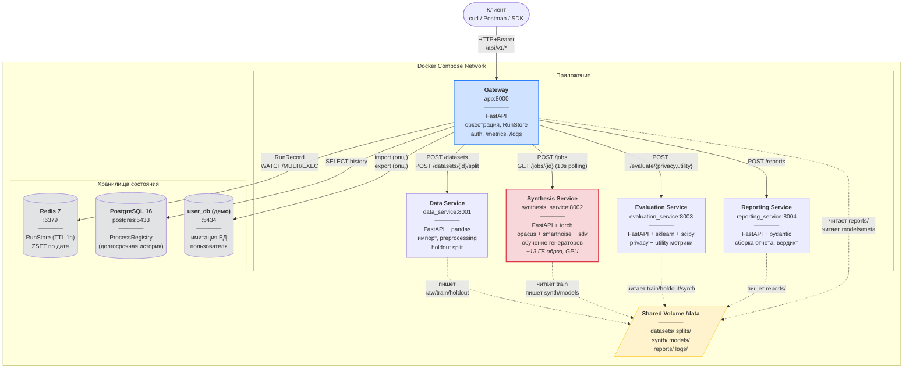

### 4.2. Перечень контейнеров

| Контейнер | Образ | Порт хоста | Технологии | Размер | Stateful? |
|---|---|---|---|---|---|
| `app` (Gateway) | `Dockerfile` | 8000 | FastAPI, httpx, redis, sqlalchemy, pandas | ~150 МБ | нет (через Redis/PG) |
| `data_service` | `services/data_service/Dockerfile` | 8001 | FastAPI, pandas, sqlalchemy, sklearn | ~500 МБ | нет |
| `synthesis_service` | `services/synthesis_service/Dockerfile` | 8002 | FastAPI, torch, opacus, smartnoise-synth, sdv, ctgan | ~13 ГБ | условно (in-memory job_store) |
| `evaluation_service` | `services/evaluation_service/Dockerfile` | 8003 | FastAPI, sklearn, scipy, pandas | ~600 МБ | нет |
| `reporting_service` | `services/reporting_service/Dockerfile` | 8004 | FastAPI, pydantic, pyyaml | ~150 МБ | нет |
| `redis` | `redis:7-alpine` | 6379 | Redis | ~50 МБ | да (RunStore) |
| `postgres` | `postgres:16-alpine` | 5433 | PostgreSQL | ~250 МБ | да (ProcessRegistry) |
| `user_db` | `postgres:16-alpine` | 5434 | PostgreSQL | ~250 МБ | да (демо) |

### 4.3. Топология взаимодействий

* **Все клиентские вызовы** идут через **Gateway** — единая точка входа,
  единая точка авторизации, единая точка наблюдаемости.
* Gateway **синхронно** вызывает 4 микросервиса через `httpx` из
  `BackgroundTasks` (см. ADR-010); никаких прямых вызовов client → микросервис
  нет.
* Артефакты (CSV, pickle, JSON) **передаются через shared volume**, а не
  телом HTTP (ADR-003); по сети ходят только метаданные и пути.
* **Внутренние сервисы не имеют авторизации** — они доступны только внутри
  docker-сети.

### 4.4. Healthcheck-зависимости при старте

`docker-compose.yml` использует `depends_on: condition: service_healthy` для
обеспечения корректного порядка старта:

```
postgres   ─────┐
redis      ─────┤
data       ─────┤
synthesis  ─────┼──► app (Gateway)
evaluation ─────┤
reporting  ─────┘
```

Gateway не стартует, пока все 4 микросервиса + Redis + PostgreSQL не
прошли healthcheck.

---

## 5. Компонентная архитектура (C4 Level 3)

Каждый сервис — это FastAPI-приложение с однородной структурой
(`main.py` + `router.py` + `settings.py`), но внутренние компоненты
сильно различаются. Ниже — разбор каждого.

### 5.1. Gateway (`app`)

Самый сложный сервис — оркестратор пайплайна и единственный с авторизацией.

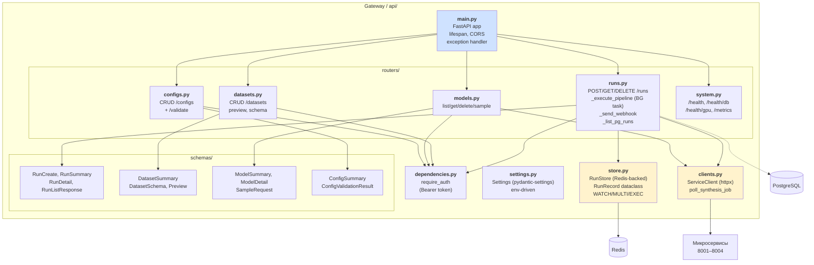

**Ключевые компоненты:**

* **`store.py:RunStore`** — единственный обладатель состояния пайплайна.
  Использует Redis с optimistic locking (3 retry на `WatchError`).
  ZSET `runs:by_created` для сортировки.
* **`clients.py:ServiceClient`** — тонкая обёртка над `httpx.Client`
  с retry-логикой (`raise_for_status`). `poll_synthesis_job` — функция
  поллинга джоба синтеза каждые 10 секунд (5 секунд в `quick_test`).
* **`routers/runs.py:_execute_pipeline`** — оркестратор из 7 шагов;
  работает в `BackgroundTasks` потоке. Подробности — раздел 6.
* **`routers/system.py:get_metrics`** — собирает метрики из RunStore
  и формирует Prometheus exposition format.
* **`dependencies.py:require_auth`** — `HTTPBearer`, в dev отключается
  если `API_KEY` не задан.

### 5.2. Data Service

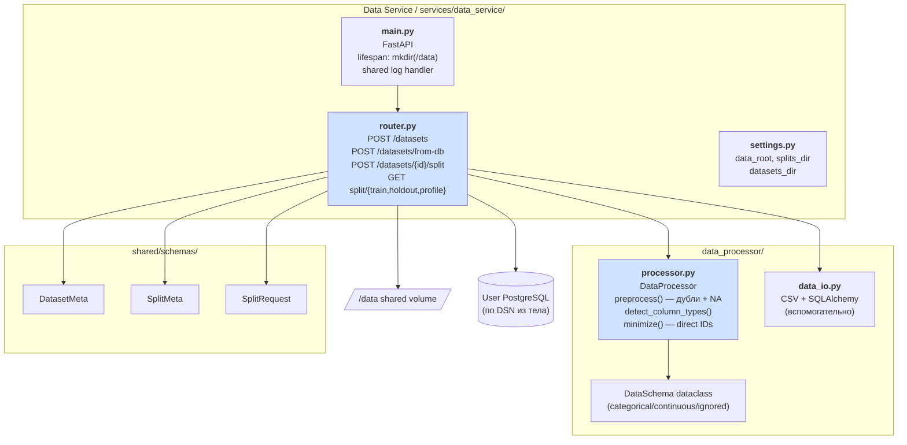

**Ключевые компоненты:**

* **`data_processor/processor.py:DataProcessor`** — три ключевые операции:
  * `preprocess()` — удаление полных дубликатов, заполнение пропусков
    (median для числовых, mode для категориальных);
  * `detect_column_types()` — автоматическое определение типов
    (object → categorical, числовые с ≤15 уникальными → categorical,
    остальные числовые → continuous, datetime → ignored);
  * `minimize()` — удаление прямых идентификаторов и опционально
    высоко-кардинальных колонок (с порогом).
* **`router.py:split_dataset`** — атомарно объединяет preprocessing,
  minimization, detection, **stratified split** и сохранение всех
  артефактов под единым `split_id` (см. ADR-015).
* **`router.py:_build_profile`** — формирует JSON-профиль
  предобработанного датасета (`profile.json`) — типы, null_pct,
  min/max/mean/median/std для числовых, top-5 значений для категориальных.

### 5.3. Synthesis Service

Самый «тяжёлый» сервис: 13 ГБ образ, GPU, длительные джобы.

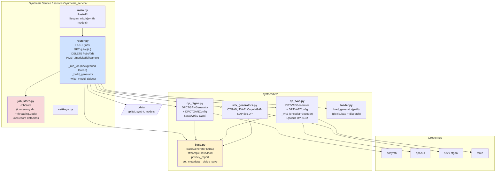

**Ключевые компоненты:**

* **`synthesizer/base.py:BaseGenerator`** — ABC, единый контракт пяти
  генераторов:
  ```python
  fit(data, categorical_columns, continuous_columns) -> None
  sample(n_rows) -> pd.DataFrame
  privacy_report() -> Dict[str, Any]
  save(path) -> None
  load(path) -> BaseGenerator   # classmethod
  ```
  Точка расширения — добавление нового генератора = новый файл
  + ветка в `_build_generator()`.
* **`router.py:_build_generator`** — единственное место, где
  `generator_type` (string) превращается в конкретный класс.
  Inline-конфиг (см. ADR-011) приходит в `body.generator`.
* **`router.py:_run_job`** — фоновый поток (создаётся через
  `threading.Thread(daemon=True)` в обработчике `POST /jobs`):
  1. Загружает SplitMeta + train.csv;
  2. Валидирует `body.generator` через `GeneratorYamlConfig`;
  3. Строит генератор;
  4. **Проверяет cancellation** перед `fit()`;
  5. `generator.fit(...)`;
  6. **Проверяет cancellation** перед `sample()`;
  7. `generator.sample(n_rows)`;
  8. Сохраняет `synthetic_pending.csv`;
  9. При `save_model=true` — `generator.save(pkl_path)` + sidecar.
* **`job_store.py:JobStore`** — простой dict под `threading.Lock`.
  См. ADR-008 (известный технический долг).

### 5.4. Evaluation Service

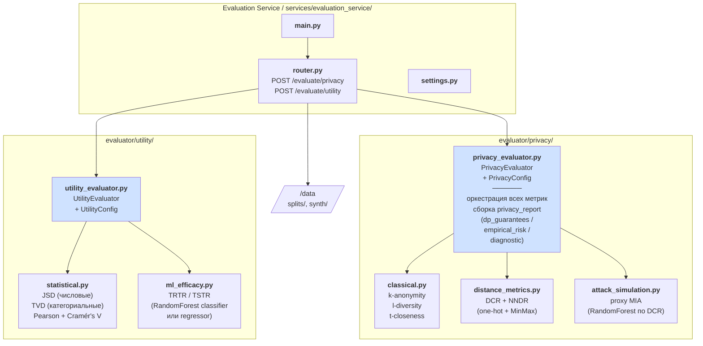

**Ключевые компоненты:**

* **`PrivacyEvaluator`** — оркестратор; принимает
  `(real_train_df, real_holdout_df, synth_df, dp_report)` и возвращает
  `privacy_report` с тремя независимыми разделами:
  * `dp_guarantees` — формальные гарантии из `dp_report` генератора;
  * `empirical_risk.distance_metrics` — DCR, NNDR;
  * `empirical_risk.membership_inference` — proxy MIA;
  * `diagnostic.classical` — k/l/t (только если заданы QI и SA).
* **`UtilityEvaluator`** — оркестратор; принимает
  `(real_train_df, synth_df, real_test_df)` и возвращает `utility_report`:
  * `statistical` — JSD, TVD, summary;
  * `correlations` — Pearson MAE, Cramér's V MAE;
  * `ml_efficacy` — TRTR, TSTR, utility_loss.
* **One-hot + MinMax кодирование** в `distance_metrics._encode_and_normalize`
  и `attack_simulation._encode` — сознательный выбор вместо LabelEncoder
  (LabelEncoder вводит искусственный порядок между категориями, искажая
  расстояния; см. docstring модулей).

### 5.5. Reporting Service

Самый минимальный сервис.

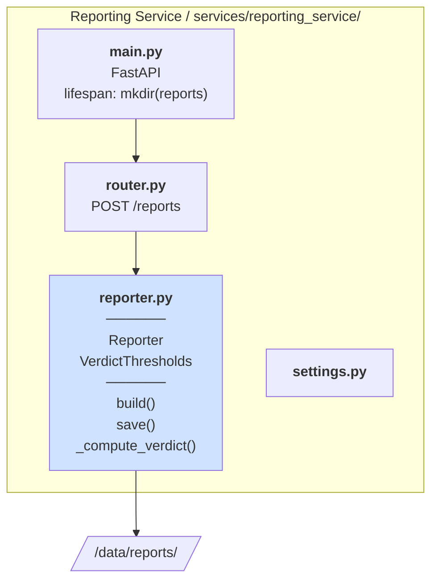

**Ключевые компоненты:**

* **`Reporter.build`** — склеивает `dp_report`, `utility_report`,
  `privacy_report`, `minimization_report` в единый JSON; вычисляет
  `verdict`.
* **`Reporter._compute_verdict`** — три проверки:
  * `utility_ok` = `utility_loss ≤ max_utility_loss` AND `mean_jsd ≤ max_mean_jsd`;
  * `privacy_ok` = `attack_auc ≤ max_mia_auc` AND (`require_dcr_privacy_preserved` ⇒ `dcr.privacy_preserved == true`);
  * `dp_ok` = (`require_dp_enabled` ⇒ `is_dp_enabled == true`) AND (`max_spent_epsilon` ⇒ `spent_epsilon ≤ max_spent_epsilon`).
* Результирующий `overall`:
  * `PARTIAL` — хотя бы одна из трёх проверок не вычислялась
    (отсутствует sub-отчёт);
  * `PASS` — все вычисленные проверки прошли;
  * `FAIL` — хотя бы одна вычисленная проверка не прошла.
* **`Reporter.save`** — пишет JSON в `reports/{dataset}__{generator}__{ts}.json`.

---

## 6. Динамические виды (Process / Sequence)

### 6.1. Happy path: создание и выполнение run

Полный пайплайн от `POST /runs` до `verdict=PASS`. Семь шагов из
`_execute_pipeline`.

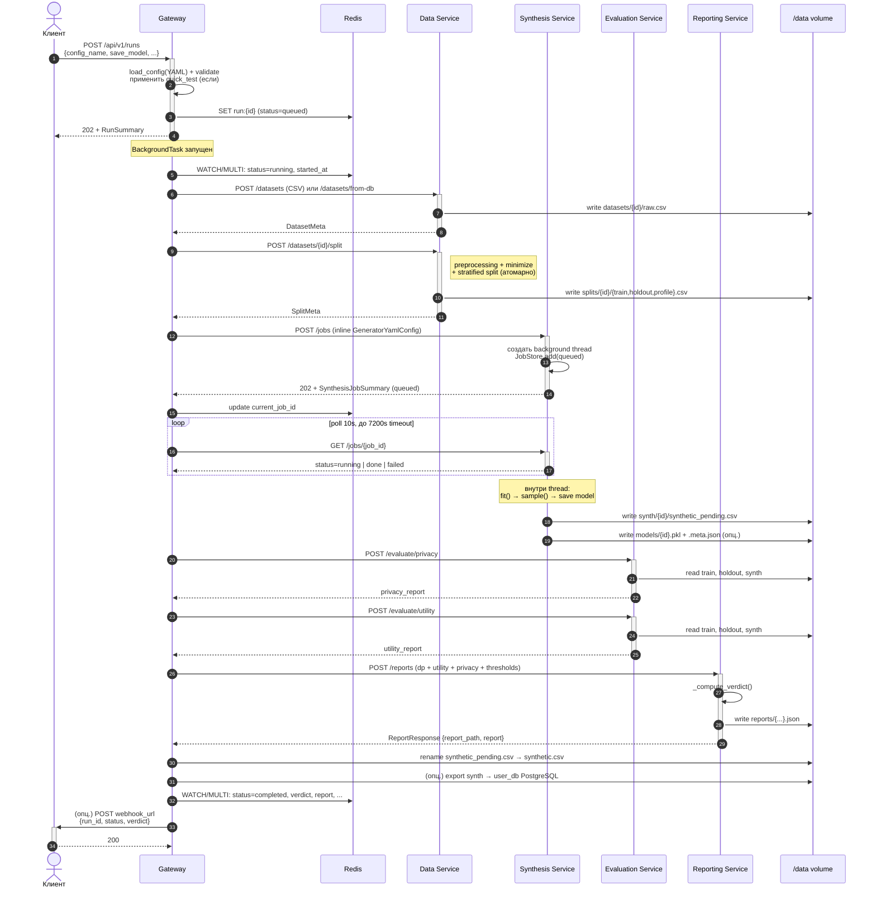

### 6.2. Polling и cancellation

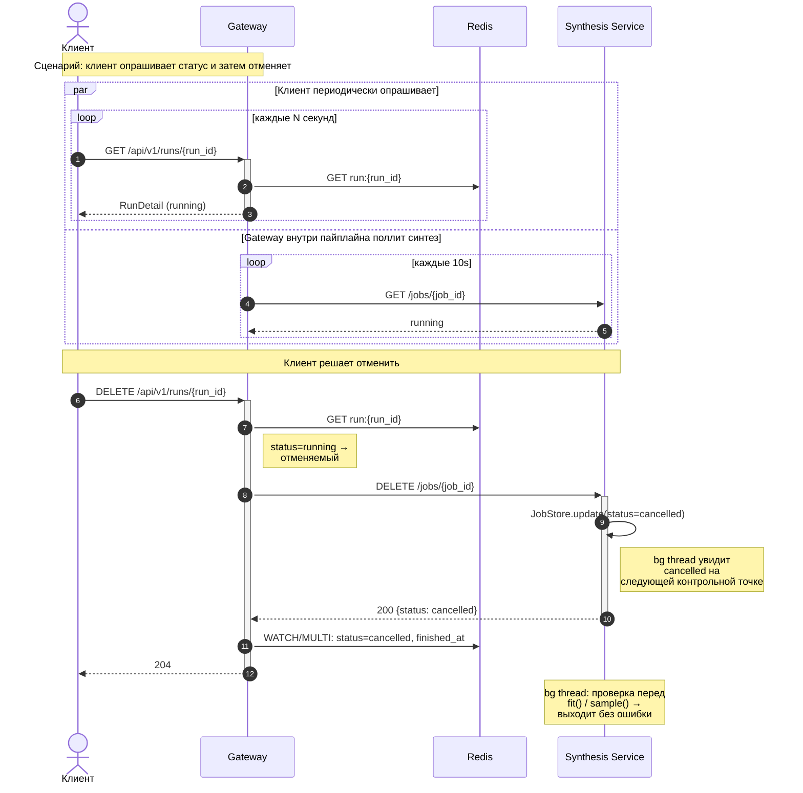

### 6.3. Сценарии ошибок

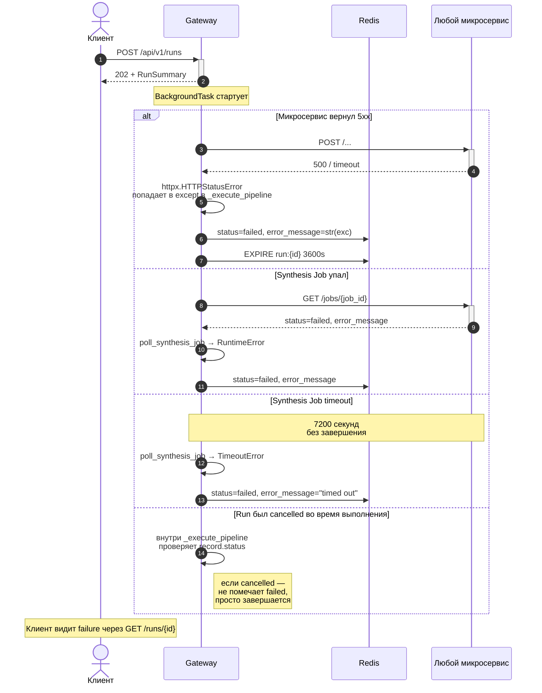

### 6.4. Повторное обучение при FAIL (`max_iterations > 1`)

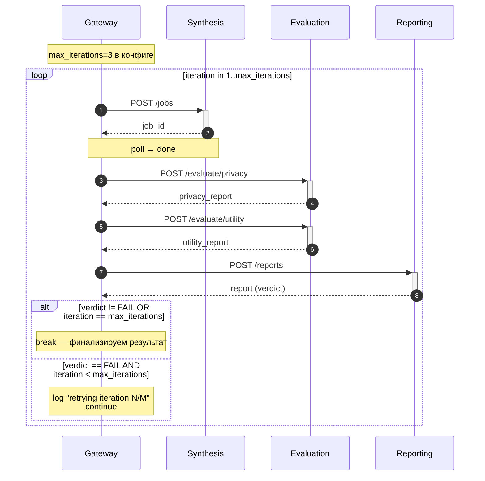

---

## 7. Логическая модель данных

### 7.1. Сводная карта сущностей

```mermaid
flowchart TB
    subgraph http["HTTP-контракты (Pydantic, shared/schemas/)"]
        H1[DatasetMeta]
        H2[SplitMeta + SplitRequest]
        H3[SynthesisJobCreate + Summary]
        H4[SampleRequest]
        H5[PrivacyEvalRequest]
        H6[UtilityEvalRequest]
        H7[ReportRequest + ReportResponse]
    end

    subgraph dom["Доменные объекты (runtime)"]
        D1[RunRecord<br/>+ RunStatus]
        D2[JobRecord<br/>+ JobStatus]
        D3[DataSchema]
    end

    subgraph cfg["Конфиг (config_loader.py)"]
        C1[AppConfig]
        C2[GeneratorYamlConfig]
        C3[ThresholdsYamlConfig]
        C4[PipelineConfig]
        C5[DataSchemaYamlConfig]
        C6[UtilityYamlConfig]
        C7[PrivacyYamlConfig]
        C8[DataImportConfig]
        C9[DataExportConfig]
    end

    subgraph art["Артефакты (FS + БД)"]
        A1[/raw.csv/]
        A2[/train.csv + holdout.csv + profile.json/]
        A3[/synthetic.csv/]
        A4[/{model_id}.pkl + .meta.json/]
        A5[/report.json/]
        A6[(processes table<br/>в PostgreSQL)]
        A7[(run:{id}<br/>в Redis)]
    end

    C1 --- C2 & C3 & C4 & C5 & C6 & C7 & C8 & C9
    H3 -.uses.-> C2
    H7 -.uses.-> C3
    D1 -.snapshot.-> C1
    D1 --- A7
    A6 -.linked by run_id.-> D1
```

### 7.2. RunRecord (главный stateful-объект)

Источник истины — `final_system/api/store.py:RunRecord`. Хранится в Redis
по ключу `run:{run_id}`; индексируется ZSET'ом `runs:by_created`.

| Поле | Тип | Назначение |
|---|---|---|
| `run_id` | UUID4 (str) | первичный ключ |
| `dataset_name` | str | для UI/фильтрации |
| `config_name` | str | имя YAML-конфига без `.yaml` |
| `status` | RunStatus | `queued/running/completed/failed/cancelled` |
| `verdict` | str? | `PASS/FAIL/PARTIAL`, после завершения |
| `save_model` | bool | сохранять ли модель |
| `webhook_url` | str? | URL для уведомления |
| `n_synth_rows` | int? | количество строк к генерации (None = размер train) |
| `current_job_id` | UUID? | id активного джоба синтеза (для cancellation) |
| `model_id` | UUID? | id сохранённой модели |
| `synth_rows` | int? | сколько строк синтетики на самом деле |
| `synth_path` | str? | абсолютный путь к synthetic.csv |
| `report_path` | str? | абсолютный путь к JSON отчёту |
| `report` | dict? | сам отчёт (для прямого доступа без чтения файла) |
| `config_snapshot` | dict? | копия YAML-конфига на момент запуска |
| `error_message` | str? | при failed |
| `created_at` | datetime | UTC ISO-8601 |
| `started_at` | datetime? | момент перехода в running |
| `finished_at` | datetime? | момент перехода в completed/failed/cancelled |

**Жизненный цикл:**

```
queued → running → completed
                ↘  failed
                ↘  cancelled
```

После `failed` устанавливается TTL 3600 сек.

### 7.3. JobRecord (in-memory в Synthesis Service)

`final_system/services/synthesis_service/job_store.py:JobRecord`.
Хранится в `Dict[job_id, JobRecord]` под `threading.Lock`.

Поля и состояния идентичны RunRecord по идее (`queued/running/done/failed/
cancelled`), но в значительно меньшем объёме (нет конфига, нет verdict,
нет webhook).

Между JobRecord (synthesis-internal) и RunRecord (gateway-internal) есть
**связь через `current_job_id`** — Gateway сохраняет id текущего джоба
для возможности отмены.

### 7.4. Структура итогового JSON-отчёта

Источник — `services/reporting_service/reporter.py:Reporter.build`.

```jsonc
{
  "report_id": "uuid",
  "process_id": "run_id",       // связующий ключ с RunRecord / processes
  "generated_at": "ISO-8601",
  "dataset_name": "adult_census",
  "generator_type": "dpctgan",

  "verdict": {
    "overall": "PASS | FAIL | PARTIAL",
    "utility_ok": true,
    "privacy_ok": true,
    "dp_ok": true,
    "issues": []                 // список причин при FAIL
  },

  "data_processing": {
    "minimization": {
      "removed_direct_identifiers": [],
      "removed_high_cardinality": [],
      "columns_before": 15,
      "columns_after": 14
    }
  },

  "generator": { /* dp_report от generator.privacy_report() */ },
  "utility":   { /* utility_report от UtilityEvaluator */ },
  "privacy":   { /* privacy_report от PrivacyEvaluator */ }
}
```

### 7.5. PostgreSQL: ProcessRegistry

Таблица `synthetic_data_schema.processes` (инициализация —
`db/init_db.sql`):

| Колонка | Тип | Назначение |
|---|---|---|
| `process_id` | UUID PK | = `run_id` Gateway |
| `start_time` | TIMESTAMP | когда run начался |
| `end_time` | TIMESTAMP | когда run завершился |
| `status` | TEXT | `RUNNING / COMPLETED_PASS / COMPLETED_FAIL / COMPLETED_PARTIAL / ERROR` |
| `source_data_info` | TEXT | путь к исходному CSV |
| `config_rout` | TEXT | путь к использованному YAML |

Запись в `processes` производится отдельно от Redis — это «холодный»
архив (см. ADR-007). При недоступности БД (или `DB_DISABLED=true`)
Gateway работает без неё.

---

## 8. Хранение и жизненный цикл артефактов

### 8.1. Карта хранилищ

| Артефакт | Где | Кто пишет | Кто читает | TTL/удаление |
|---|---|---|---|---|
| RunRecord | Redis | Gateway | Gateway | TTL 1ч после `failed`; `completed` без TTL |
| Историческая запись | PostgreSQL | Gateway | Gateway | без удаления (DBA-задача) |
| JobRecord | in-memory dict | Synthesis | Synthesis (+ Gateway через GET) | живёт до рестарта контейнера |
| `datasets/{id}/raw.csv` | shared volume | Data Service | Data Service | без автоочистки |
| `splits/{id}/train.csv` | shared volume | Data Service | Synthesis, Evaluation | без автоочистки |
| `splits/{id}/holdout.csv` | shared volume | Data Service | Evaluation | без автоочистки |
| `splits/{id}/profile.json` | shared volume | Data Service | (доступно через GET) | без автоочистки |
| `synth/{id}/synthetic.csv` | shared volume | Synthesis | Evaluation, Gateway | без автоочистки |
| `models/{id}.pkl` | shared volume | Synthesis | Synthesis (sample), Gateway удаляет | по DELETE |
| `models/{id}.meta.json` | shared volume | Synthesis | Gateway | удаляется вместе с .pkl |
| `reports/...json` | shared volume | Reporting | Gateway | без автоочистки |
| Логи (`logs/{service}.log`) | shared volume | каждый сервис | Gateway (`/runs/{id}/logs`) | без ротации (известный долг) |

### 8.2. Атомарность критичных операций

* **Split** (Data Service) — train.csv, holdout.csv, profile.json,
  meta.json пишутся в одной операции; в случае падения посередине
  весь `split_id` будет считаться невалидным, поскольку `meta.json`
  пишется последним.
* **Финализация синтетики** — Synthesis пишет в `synthetic_pending.csv`,
  Gateway после успешного `verdict` переименовывает в `synthetic.csv`
  (FS rename атомарен на одном FS). Это гарантирует, что
  потребители (`POST /runs/{id}/synthetic`, экспорт в БД) не получат
  «полу-готовую» синтетику.
* **RunStore.update** — оптимистическая блокировка через `WATCH/MULTI/
  EXEC` (до 3 retry на `WatchError`). Гарантирует, что параллельные
  `update` (например, со стороны webhook handler'а и завершения
  пайплайна) не затрут друг друга.

### 8.3. Что НЕ обеспечено

* **Versioning артефактов.** Повторная загрузка датасета с тем же
  именем — затирает.
* **Шифрование at rest.** Все CSV, pkl, JSON лежат plaintext.
* **Ротация логов.** Файлы `logs/*.log` растут бесконечно.
* **Автоочистка «брошенных» splits** — если run упал между split'ом
  и synthesis, `splits/{id}/` остаётся.

Все эти пункты — известный технический долг (PRD раздел 12).

---

## 9. Деплоймент-вид

### 9.1. Топология `docker-compose.yml`

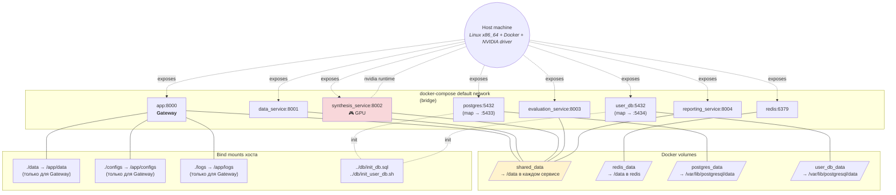

### 9.2. Порты

| Контейнер | Внутренний | Внешний | Назначение |
|---|---|---|---|
| `app` | 8000 | 8000 | публичный API + Swagger |
| `data_service` | 8001 | 8001 | дебаг (внутр. в проде закрыт) |
| `synthesis_service` | 8002 | 8002 | дебаг |
| `evaluation_service` | 8003 | 8003 | дебаг |
| `reporting_service` | 8004 | 8004 | дебаг |
| `redis` | 6379 | 6379 | дебаг |
| `postgres` | 5432 | 5433 | дебаг |
| `user_db` | 5432 | 5434 | демо |

Все «дебаг»-порты в production должны быть закрыты от внешнего доступа
(сейчас открыты для удобства локальной разработки).

### 9.3. Healthcheck'и

| Сервис | Команда | Период |
|---|---|---|
| `app` | (отсутствует в compose, но есть `/api/v1/health`) | — |
| `data_service` | `python -c "urllib.request.urlopen('http://localhost:8001/health')"` | 10s |
| `synthesis_service` | то же на 8002 | 10s |
| `evaluation_service` | то же на 8003 | 10s |
| `reporting_service` | то же на 8004 | 10s |
| `redis` | `redis-cli ping` | 5s |
| `postgres` | `pg_isready -U postgres -d synthetic_data_db` | 5s |
| `user_db` | `pg_isready -U user -d postgres` | 5s |

`app` стартует только после healthy-статуса всех остальных
(`depends_on: condition: service_healthy`).

### 9.4. GPU

GPU прокидывается через nvidia-container-toolkit:

```yaml
deploy:
  resources:
    reservations:
      devices:
        - driver: nvidia
          count: 1
          capabilities: [gpu]
```

Только в `synthesis_service`. Остальные сервисы запускаются на CPU.
В коде CUDA-доступ контролируется флагом `cuda: true/false` в
GeneratorYamlConfig — при отсутствии GPU сервис должен gracefully
fallback на CPU (ответственность генераторов).

### 9.5. Переменные окружения

Все из `.env.example`. Группы:

| Группа | Переменные | Назначение |
|---|---|---|
| Системная БД | `DB_HOST`, `DB_PORT`, `DB_NAME`, `DB_USER`, `DB_PASSWORD`, `DB_SCHEMA`, `DB_DISABLED` | ProcessRegistry |
| Redis | `REDIS_URL` | RunStore |
| Импорт/экспорт | `DB_IMPORT_DSN`, `DB_EXPORT_DSN` | DSN внешних БД |
| Auth | `API_KEY` | Bearer-токен |
| Адреса сервисов | `DATA_SERVICE_URL`, `SYNTHESIS_SERVICE_URL`, `EVALUATION_SERVICE_URL`, `REPORTING_SERVICE_URL` | межсервисные httpx-вызовы |

В `docker-compose.yml` адреса жёстко прописаны под имена сервисов
(`http://data_service:8001` и т.д.) — это override от `.env.example`,
который описывает локальный сценарий запуска.

### 9.6. Профиль ресурсов

Грубые ориентиры (см. PRD NFR-04, 05):

| Сервис | RAM | CPU | GPU | Диск (образ) |
|---|---|---|---|---|
| `app` | 200 МБ | 0.5 vCPU | — | 150 МБ |
| `data_service` | 1–2 ГБ * | 1 vCPU | — | 500 МБ |
| `synthesis_service` | 4–16 ГБ ** | 2–8 vCPU | 8 ГБ VRAM | 13 ГБ |
| `evaluation_service` | 1–2 ГБ * | 1 vCPU | — | 600 МБ |
| `reporting_service` | 100 МБ | 0.1 vCPU | — | 150 МБ |
| `redis` | 100 МБ | 0.1 vCPU | — | 50 МБ |
| `postgres` | 200 МБ | 0.2 vCPU | — | 250 МБ |
| `user_db` | 200 МБ | 0.2 vCPU | — | 250 МБ |

\* зависит от размера загружаемого CSV.
\*\* существенно зависит от датасета и параметров генератора.

---

## 10. Конфигурационная модель

### 10.1. Иерархия конфигов

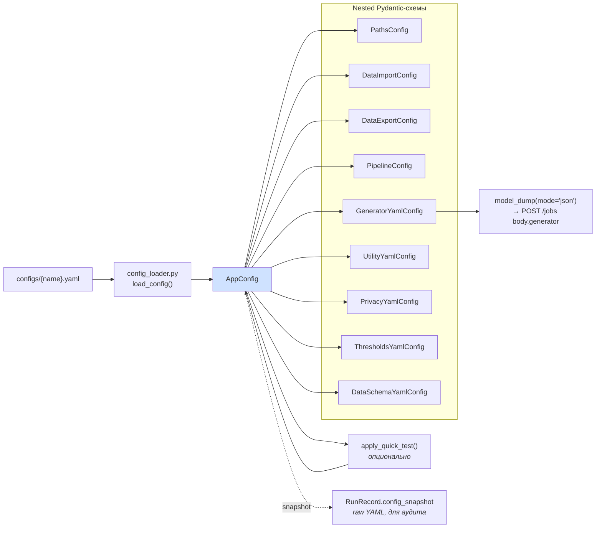

### 10.2. Конвенция: единый источник правды

* **YAML-файл** в `configs/` — статический шаблон, версионируется в git.
* **`AppConfig`** — runtime-объект, валидированный Pydantic-ом.
  Ошибки конфига (опечатки, неверные типы, нарушения инвариантов)
  ловятся при `load_config()`, до запуска любого ML-кода.
* **`RunRecord.config_snapshot`** — копия исходного YAML, фиксируемая
  на момент `POST /runs`. Если `configs/adult.yaml` изменится после
  запуска — `config_snapshot` сохранит, какие параметры реально были
  использованы.
* **`GeneratorYamlConfig`** — единственная часть конфига, которая
  передаётся между сервисами (Gateway → Synthesis Service inline,
  см. ADR-011).

### 10.3. quick_test mode

Применяется к `AppConfig` через `apply_quick_test(cfg)` если в запросе
`POST /runs` указано `quick_test: true`. Изменяемые поля
(`config_loader.py:apply_quick_test`):

| Поле | Прод-значение | quick_test |
|---|---|---|
| `pipeline.sample_size` | 0 (все строки) | 5000 |
| `generator.epochs` | 300 | 50 |
| `generator.cuda` | true | false |
| `privacy.distance_sample_size` | 2000 | 500 |
| `privacy.mia_sample_size` | 1000 | 250 |
| `thresholds.max_utility_loss` | 0.15 | 0.40 |
| `thresholds.max_mean_jsd` | 0.20 | 0.40 |
| `thresholds.max_mia_auc` | 0.55 | 0.65 |
| `thresholds.max_spent_epsilon` | 5.0 | None |

quick_test проверяет, что **пайплайн проходит end-to-end без падений** —
не качество синтетики. Поэтому пороги вердикта намеренно ослаблены.

### 10.4. Профили DP по отраслям (рекомендация)

В YAML-конфиге `epsilon` задаётся вручную; рекомендации:

| Отрасль | ε | δ | Профиль риска |
|---|---|---|---|
| Финансы / здравоохранение | 1.0 – 2.0 | автонастройка 1/(n·√n) | строгий регулятор, высокий риск |
| Общий enterprise (default) | 2.0 – 5.0 | то же | стандартный профиль |
| R&D / аналитика | 5.0 – 10.0 | то же | качество важнее приватности |

Default в `configs/adult.yaml` — `epsilon: 3.0`, что соответствует
середине enterprise-профиля.

---

## 11. Сквозные аспекты (Cross-cutting concerns)

### 11.1. Аутентификация

Текущая реализация — Bearer-token, единый ключ для всего API:

```
Authorization: Bearer <API_KEY>
```

Реализация — `final_system/api/dependencies.py:require_auth`:
* `HTTPBearer(auto_error=False)` — токен опционален на уровне FastAPI;
* проверка значения внутри функции;
* если `settings.api_key is None` — auth отключена (dev-режим).

Все защищённые ручки имеют `_: None = Depends(require_auth)` в сигнатуре.
`/health` и `/metrics` — без auth (для probe и Prometheus).

**Внутренние сервисы (8001–8004) — без авторизации** (доступны только
из docker-сети). Это приемлемо для MVP, но в production — гэп
(см. PRD 12.4.1, цель — OIDC + RBAC + service-to-service mTLS).

### 11.2. Логирование

Сквозной `run_id` через `ContextVar` — реализация в
`final_system/shared/log_context.py`:

```python
_run_id_var: ContextVar[str] = ContextVar("run_id", default="")
def set_run_id(run_id): _run_id_var.set(run_id or "")

class RunIdFormatter(logging.Formatter):
    def format(self, record):
        rid = _run_id_var.get()
        record.run_id_tag = f" [run {rid}]" if rid else ""
        return super().format(record)

LOG_FORMAT = "[%(asctime)s]%(run_id_tag)s [%(levelname)s] %(name)s: %(message)s"
```

Каждый сервис в `main.py:lifespan` устанавливает форматтер на корневой
logger и добавляет файл-хендлер в `/data/logs/{service}.log` (логи
доступны всем сервисам через shared volume).

В обработчиках, где run_id известен (`POST /runs`, `_execute_pipeline`,
`split_dataset`, `_run_job`, `evaluate_*`, `create_report`):

```python
set_run_id(body.run_id)
```

Это устанавливает значение в текущем контексте (потоке/корутине),
и все последующие log-записи получают тег `[run abc-123]`.

**Сборка логов по run_id** — `GET /api/v1/runs/{id}/logs`:
1. Прочитать `logs/app.log` + `/data/logs/{service}.log` × 4.
2. Отсортировать строки по timestamp.
3. Отфильтровать строки, содержащие `run_id`.
4. Прикрепить traceback-строки (с отступом) к предшествующей run-строке.
5. Опционально tail.

### 11.3. Наблюдаемость

| Endpoint | Тип | Назначение |
|---|---|---|
| `/api/v1/health` | liveness | uptime + version |
| `/api/v1/health/db` | readiness | состояние PostgreSQL + latency_ms |
| `/api/v1/health/gpu` | readiness | имя GPU + свободная VRAM |
| `/api/v1/metrics` | prometheus | счётчики + gauges |

`/metrics` (Gateway, `routers/system.py:get_metrics`):

```
# HELP synth_runs_total Total pipeline runs by status and verdict
# TYPE synth_runs_total counter
synth_runs_total{status="completed",verdict="PASS"} 42
synth_runs_total{status="failed",verdict=""} 3

# HELP synth_queue_size Current number of queued/running tasks
# TYPE synth_queue_size gauge
synth_queue_size{state="queued"} 0
synth_queue_size{state="running"} 1

# HELP synth_run_duration_seconds_avg Average pipeline duration
# TYPE synth_run_duration_seconds_avg gauge
synth_run_duration_seconds_avg 1234.56
```

Это **минимально достаточный набор** для MVP. Production-набор
описан в PRD 12.3.3 (RED-метрики на каждой ручке, GPU-метрики
через NVIDIA DCGM exporter, business-метрики DP-ε на tenant).

### 11.4. Обработка ошибок

* Единый формат ответа об ошибке — `{code, message}`.
* Известные коды:

| code | HTTP | Когда |
|---|---|---|
| `UNAUTHORIZED` | 401 | нет/невалидный Bearer |
| `NOT_FOUND` | 404 | ресурс не существует |
| `VALIDATION_ERROR` | 400 | невалидный body / параметр |
| `CONFLICT` | 409 | имя занято / пересечение |
| `RUN_NOT_FINISHED` | 409 | запрос артефакта при `running` |
| `MODEL_NOT_SAVED` | 409 | догенерация без `save_model=true` |
| `DB_ERROR` | 400 | ошибка SQL при импорте |
| `SAMPLE_ERROR` | 500 | ошибка `pickle.load` или `sample()` |
| `INTERNAL_ERROR` | 500 | необработанное исключение (catch-all) |
| `NOT_READY` | 409 | DP-отчёт запрошен до `done` |

* Глобальный exception handler (`@app.exception_handler(Exception)`)
  на каждом сервисе превращает любое необработанное исключение в
  500 + `INTERNAL_ERROR`.
* `_execute_pipeline` ловит исключения сам и помечает run как `failed`
  с `error_message=str(exc)`. Никакие исключения не теряются.

### 11.5. Воспроизводимость

Поддерживается на трёх уровнях:

1. **Random seed.** `random_seed: 42` (default) в `GeneratorYamlConfig`
   и `random_state: 42` в `PipelineConfig`/`UtilityYamlConfig`/
   `PrivacyYamlConfig`. Передаётся во все стохастические операции:
   `train_test_split`, `numpy.random`, `torch.manual_seed`,
   smartnoise/ctgan-инициализации.
2. **Config snapshot.** `RunRecord.config_snapshot` сохраняет YAML
   на момент запуска. Изменения в `configs/` не влияют на возможность
   восстановить exact configuration прошлого run.
3. **Версии зависимостей.** Каждый сервис имеет `requirements.txt`
   с фиксированными minor-версиями (`fastapi>=0.111.0`, `pydantic>=2.0.0`,
   и т.д.). Образы тегированы конкретными versions
   (`postgres:16-alpine`, `redis:7-alpine`).

### 11.6. Concurrency

| Точка | Механизм |
|---|---|
| RunStore.update | optimistic locking `WATCH/MULTI/EXEC`, до 3 retry |
| JobStore | `threading.Lock` (single-worker, потоки одного процесса) |
| Файловая запись на `/data` | гарантируется single-worker (`--workers 1`); атомарность через rename |
| `BackgroundTasks` | FastAPI выполняет sync-функцию в threadpool; одновременно может работать несколько пайплайнов |

Конкурентность пайплайнов: Gateway-`BackgroundTasks` запустит сколько
угодно одновременных `_execute_pipeline` (ограничено только
threadpool'ом FastAPI и общим CPU/RAM). Synthesis Service также
обработает несколько параллельных `POST /jobs` (каждый в своём потоке).
**Однако** GPU физически одна — два конкурентных тяжёлых обучения
будут конкурировать за VRAM. Это не задано лимитами — производственное
ограничение клиента.

---

## 12. Качественные атрибуты

Сводная таблица. Целевые значения — из PRD; реализация — из кода.

| Атрибут | Целевое (PRD) | Текущая реализация | Гэп / план |
|---|---|---|---|
| **Performance: POST /runs p95** | < 500 мс | синхронная валидация YAML + создание RunRecord; типично < 100 мс | OK |
| **Performance: /health p95** | < 50 мс | простой ответ из памяти | OK |
| **Performance: quick_test full pipeline** | < 5 мин | 5000 строк × 50 эпох на CPU | OK |
| **Performance: prod pipeline 1M строк** | ≤ 4 часа | DP-CTGAN 300 эпох + 1 GPU | зависит от датасета и ε |
| **Reliability: graceful БД** | работает без PG | `DB_DISABLED=true`; `_list_pg_runs` возвращает `[]` при ошибке | OK |
| **Reliability: атомарность синтеза** | rename pending → final | реализовано в `_execute_pipeline` | OK |
| **Security: auth** | Bearer | реализовано; `API_KEY` env | OIDC, mTLS — PRD 12.4 |
| **Security: encryption at rest** | требуется в prod | отсутствует | KMS — PRD 12.4.4 |
| **Maintainability: добавить генератор** | без перебилда Gateway | новый файл в `synthesizer/` + ветка в `_build_generator` | поддержано (ADR-011, ADR-012) |
| **Maintainability: подменить сервис** | заказчиком, по контракту | `shared/schemas/` + OpenAPI | поддержано (ADR-001, ADR-005) |
| **Testability: unit** | `pytest -m "not e2e"` | 4 файла unit-тестов | OK |
| **Testability: e2e** | `pytest -m e2e` через docker-compose | 1 e2e-тест полного пайплайна | OK |
| **Observability: метрики** | Prometheus формат | `/metrics` на Gateway | расширить до RED + GPU — PRD 12.3.3 |
| **Observability: трассировка** | run_id во всех 5 контейнерах | `RunIdFormatter` + `ContextVar` | дополнить OpenTelemetry — PRD 12.3.2 |
| **Воспроизводимость** | random_seed + config_snapshot | реализовано | OK |
| **Compatibility: Python** | 3.10+ | соблюдено | OK |

---

## 13. ML-методологический срез

Этот раздел описывает архитектурные следствия методологических решений
по приватности и оценке. Связь с ADR-013 (DP-фреймворки) и ADR-015
(holdout-инвариант).

### 13.1. Три раздела `privacy_report`

`PrivacyEvaluator` строго разделяет три **разных по природе** группы
показателей:

```
privacy_report:
  dp_guarantees:        ← формальная математическая гарантия
                          (что генератор обещает по DP)
  empirical_risk:       ← проверка эмпирическими атаками
                          (что мы реально измерили)
  diagnostic.classical: ← структурные свойства таблицы
                          (k/l/t — диагностика, не гарантия)
```

Это разделение **не косметическое**: оно отражает разницу в семантике.
`dp_guarantees` — теорема (доказательство в работе Abadi et al.).
`empirical_risk` — экспериментальная проверка (нашли ли утечку
на конкретной атаке). `diagnostic.classical` — давно известные метрики
анонимности, которые не дают формальных гарантий, но полезны для
описания структуры.

Логика вердикта (`reporter._compute_verdict`) учитывает все три:
* `dp_ok` — из `dp_guarantees`;
* `privacy_ok` — из `empirical_risk` (DCR + MIA);
* `diagnostic.classical` — пишется в отчёт, но **в вердикт не входит**
  (k/l/t — справочные).

### 13.2. Holdout-инвариант

Архитектурная гарантия (см. ADR-015):
* Data Service делает split один раз.
* Synthesis Service читает только `train.csv`.
* Evaluation Service читает оба (`train.csv`, `holdout.csv`).
* Структурно невозможно «случайно» обучить генератор на holdout
  (другой файл, другой относительный путь).

Это ключевой инвариант для корректности privacy-метрик. Если бы
holdout был известен генератору — MIA AUC всегда был бы низким
не потому, что генератор не запоминает, а потому что атакующий
видел ту же выборку.

### 13.3. Логика PASS / FAIL / PARTIAL

Реализация — `services/reporting_service/reporter.py:_compute_verdict`:

```python
checks = {"utility_ok": None, "privacy_ok": None, "dp_ok": None}

if utility_report:
    # проверка utility_loss и mean_jsd
    checks["utility_ok"] = (no_utility_issues)

if privacy_report:
    # проверка attack_auc и dcr.privacy_preserved
    checks["privacy_ok"] = (no_privacy_issues)

if dp_report:
    # проверка is_dp_enabled и spent_epsilon
    checks["dp_ok"] = (no_dp_issues)

has_none = any(v is None for v in checks.values())
all_passed = all(v is True for v in checks.values() if v is not None)

if has_none and all_passed:  overall = "PARTIAL"
elif all_passed:             overall = "PASS"
else:                        overall = "FAIL"
```

Семантика:
* **PASS** — все три проверки активны и пройдены.
* **FAIL** — хотя бы одна активная проверка не пройдена. `issues`
  содержит человекочитаемые причины.
* **PARTIAL** — какой-то отчёт отсутствует (например, не запрошена
  privacy-оценка), а из имеющихся всё прошло.

Семантика **PARTIAL ≠ PASS**: PARTIAL означает «не всё проверено,
формальный вердикт вынести нельзя».

### 13.4. Точка расширения: добавление нового генератора

Архитектурное правило:

```
1. Создать synthesizer/my_gen.py
   class MyGenGenerator(BaseGenerator):
       def fit(self, data, categorical_columns, continuous_columns)
       def sample(self, n_rows)
       def privacy_report(self)              # вернуть dp_config / dp_spent
       def save(self, path)                  # через _pickle_save
       @classmethod
       def load(cls, path)

2. (опц.) MyGenConfig dataclass с гиперпараметрами

3. Добавить ветку в services/synthesis_service/router.py:_build_generator()
   elif t == "my_gen":
       from synthesizer.my_gen import MyGenGenerator, MyGenConfig
       cfg = MyGenConfig(...поля из gen_yaml...)
       return MyGenGenerator(cfg)

4. Если есть новые поля гиперпараметров — добавить в
   config_loader.py:GeneratorYamlConfig

5. (опц.) Добавить ветку в _ALL_GENERATOR_TYPES /
   _DP_GENERATOR_TYPES для валидации

ВСЁ. Перебилд только synthesis_service.
```

Это поддержано ADR-001 (микросервисы), ADR-011 (inline-конфиг),
ADR-012 (lazy ML imports) и ADR-005 (Pydantic-контракты).

### 13.5. ε-budget семантика

* `fit()` — расходует DP-бюджет. Фактически потраченный ε фиксируется
  в `dp_report.dp_spent.spent_epsilon_final`.
* `sample()` — **не расходует** бюджет. Это следствие
  post-processing immunity differential privacy: применение любого
  data-independent преобразования к DP-выходу не увеличивает ε.

Архитектурное следствие: **сохранённую модель можно сэмплировать
сколько угодно раз** (`POST /models/{id}/sample`, `POST /runs/{id}/synthetic`)
без расхода бюджета. Это даёт пользователю гибкость: один train ⇒
многократная генерация подвыборок различного размера.

---

## 14. Риски, ограничения, технический долг

Сводная таблица. Все позиции описаны детально либо в соответствующих
ADR, либо в PRD раздел 12. Здесь — обзор для архитектурного контекста.

| # | Риск / долг | Приоритет | Ссылки |
|---|---|---|---|
| 1 | In-memory `job_store` теряется при рестарте synthesis_service | 🔴 P0 | ADR-008, PRD 12.1.1 |
| 2 | `BackgroundTasks` без durability — рестарт Gateway убивает пайплайны | 🔴 P0 | ADR-010, PRD 12.1.1 |
| 3 | Single-worker, single-host — отсутствие горизонтального масштабирования | 🔴 P0 | ADR-002, ADR-003, PRD 12.1.2-12.1.4 |
| 4 | Shared volume `/data` не работает между хостами | 🔴 P0 | ADR-003, PRD 12.1.3 |
| 5 | Pickle-формат моделей (RCE-риск, версия-привязка) | 🔴 P0 | ADR-009, PRD 12.4.3 |
| 6 | Single API_KEY auth, нет RBAC, нет identity | 🔴 P0 | PRD 12.4.1, 12.4.2 |
| 7 | DSN передаётся через env, без secret management | 🔴 P0 | PRD 12.4.3 |
| 8 | Нет шифрования at rest и in transit | 🔴 P0 | PRD 12.4.4 |
| 9 | Нет Model Registry (промоция, версионирование) | 🔴 P0 | PRD 12.2.1 |
| 10 | Нет Data Lineage и формального аудита | 🔴 P0 | PRD 12.2.2, 12.3.4 |
| 11 | Нет distributed tracing | 🔴 P0 | PRD 12.3.2 |
| 12 | Нет ротации логов на shared volume | 🟡 P1 | PRD 12.3.1 |
| 13 | Per-tenant privacy budget pool отсутствует | 🟡 P1 | PRD 12.4.5 |
| 14 | Нет автоочистки `splits/` и `synth/` для незавершённых runs | 🟡 P1 | — |
| 15 | Один DP-фреймворк (SmartNoise) тянет фиксированную версию torch — конфликты при обновлении | 🟡 P1 | ADR-013 |
| 16 | Proxy MIA — упрощённая версия, не shadow-model | 🟢 P2 | PRD 12.8.4 |
| 17 | Только табличные данные, без multi-table и time-series | 🟢 P2 | PRD 12.8.1, 12.8.2 |

**Общий принцип эволюции:** все P0 решаются параллельно в Phase 0
roadmap'а (3–4 месяца, см. PRD 12.11) — это базовая foundation для
production-внедрения.

---

## 15. Глоссарий и приложения

### 15.1. Глоссарий (краткий)

Полный — см. PRD раздел 13.

| Термин | Расшифровка |
|---|---|
| DP | Differential Privacy |
| DP-SGD | Differentially Private SGD (Abadi et al. 2016) |
| ε / epsilon | бюджет приватности (меньше = строже защита) |
| δ / delta | вероятность нарушения DP-гарантии |
| RDP | Rényi Differential Privacy (для accounting) |
| DCR | Distance to Closest Record |
| NNDR | Nearest Neighbor Distance Ratio |
| MIA | Membership Inference Attack |
| TRTR | Train Real, Test Real (потолок ML-качества) |
| TSTR | Train Synthetic, Test Real (качество синтетики) |
| QI | Quasi-Identifier |
| SA | Sensitive Attribute |
| ADR | Architecture Decision Record |
| SAD | Software Architecture Document |
| PRD | Product Requirements Document |
| C4 | Context-Containers-Components-Code модель архитектурных видов |
| PartIAL | вердикт «не вся информация для оценки доступна» |

### 15.2. Приложение A — реестр endpoints

Полные спеки — `openapi/*.yaml`. Здесь — сводная таблица.

#### Gateway (порт 8000, `/api/v1`)

| Метод | Путь | Назначение |
|---|---|---|
| GET | `/health` | liveness |
| GET | `/health/db` | состояние PostgreSQL |
| GET | `/health/gpu` | состояние GPU |
| GET | `/metrics` | Prometheus формат |
| GET | `/runs` | все runs (Redis + PG) |
| GET | `/runs/active` | активные runs (Redis) |
| POST | `/runs` | создать run |
| GET | `/runs/{id}` | детали run |
| DELETE | `/runs/{id}` | отменить/удалить |
| GET | `/runs/{id}/report` | JSON-отчёт |
| GET | `/runs/{id}/synthetic` | синтетика (CSV/JSON) |
| POST | `/runs/{id}/synthetic` | догенерация из модели run |
| GET | `/runs/{id}/logs` | объединённые логи |
| GET | `/datasets` | список загруженных |
| POST | `/datasets` | загрузить CSV |
| DELETE | `/datasets/{name}` | удалить |
| GET | `/datasets/{name}/schema` | автодетекция типов |
| POST | `/datasets/{name}/preview` | первые N строк + stats |
| GET | `/models` | список моделей |
| GET | `/models/{id}` | детали модели |
| DELETE | `/models/{id}` | удалить |
| POST | `/models/{id}/samples` | сэмплирование |
| GET | `/configs` | список YAML |
| POST | `/configs` | загрузить YAML |
| POST | `/configs/validate` | валидация без сохранения |
| GET | `/configs/{name}` | получить YAML |
| PUT | `/configs/{name}` | заменить |
| DELETE | `/configs/{name}` | удалить |

#### Data Service (порт 8001, `/api/v1`)

| Метод | Путь |
|---|---|
| GET | `/health` |
| POST | `/datasets` |
| POST | `/datasets/from-db` |
| GET | `/datasets/{id}` |
| POST | `/datasets/{id}/split` |
| GET | `/datasets/{id}/splits/{split_id}` |
| GET | `/datasets/{id}/splits/{split_id}/profile` |
| GET | `/datasets/{id}/splits/{split_id}/train` |
| GET | `/datasets/{id}/splits/{split_id}/holdout` |

#### Synthesis Service (порт 8002, `/api/v1`)

| Метод | Путь |
|---|---|
| GET | `/health` |
| POST | `/jobs` |
| GET | `/jobs/{id}` |
| DELETE | `/jobs/{id}` |
| GET | `/jobs/{id}/dp_report` |
| POST | `/models/{id}/sample` |

#### Evaluation Service (порт 8003, `/api/v1`)

| Метод | Путь |
|---|---|
| GET | `/health` |
| POST | `/evaluate/privacy` |
| POST | `/evaluate/utility` |

#### Reporting Service (порт 8004, `/api/v1`)

| Метод | Путь |
|---|---|
| GET | `/health` |
| POST | `/reports` |

### 15.3. Приложение B — реестр конфигов

| Файл | Генератор | DP | Назначение |
|---|---|---|---|
| `configs/adult.yaml` | dpctgan | да | основной prod-конфиг (default) |
| `configs/adult_dpctgan_db.yaml` | dpctgan | да | DP-CTGAN с импортом из PostgreSQL |
| `configs/adult_dptvae.yaml` | dptvae | да | DP-TVAE (Opacus) |
| `configs/adult_ctgan.yaml` | ctgan | нет | baseline без DP |
| `configs/adult_tvae.yaml` | tvae | нет | baseline без DP |
| `configs/adult_copulagan.yaml` | copulagan | нет | baseline без DP |
| `configs/e2e_ctgan.yaml` | ctgan | нет | минимальный конфиг для e2e-теста |

### 15.4. Приложение C — реестр ADR

Полностью — `ADR/README.md`. Здесь — сводка.

| № | Заголовок | Статус | Связан с разделом SAD |
|---|---|---|---|
| ADR-001 | Микросервисная архитектура (5 сервисов) | Принято | 4.1, 5 |
| ADR-002 | Docker Compose как платформа развёртывания | Принято | 9 |
| ADR-003 | Shared Docker volume `/data` | Принято | 4, 8 |
| ADR-004 | FastAPI как HTTP-фреймворк | Принято | 5 |
| ADR-005 | Pydantic v2 как контракт между сервисами | Принято | 7 |
| ADR-007 | Двойное хранилище: Redis + PostgreSQL | Принято | 7.5, 8.1 |
| ADR-008 | In-memory `job_store` в Synthesis Service | Принято (с долгом) | 5.3, 7.3 |
| ADR-009 | Pickle + JSON-сайдкар для моделей | Принято (временное) | 5.3, 8 |
| ADR-010 | `BackgroundTasks` FastAPI вместо Celery | Принято (с долгом) | 5.1, 6.1 |
| ADR-011 | Inline-конфиг генератора в `POST /jobs` | Принято | 5.3, 10 |
| ADR-012 | Lazy ML imports в `config_loader.py` | Принято | 10 |
| ADR-013 | SmartNoise + Opacus как DP-фреймворки | Принято | 5.3, 13.1 |
| ADR-015 | Holdout split в Data Service до синтеза | Принято | 5.2, 6.1, 13.2 |

---

*Документ описывает архитектуру по состоянию репозитория на 2026-04-25.
Изменения в архитектуре должны сопровождаться обновлением соответствующих
разделов SAD и/или новым ADR.*
